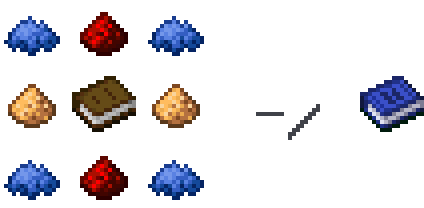
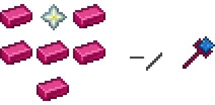
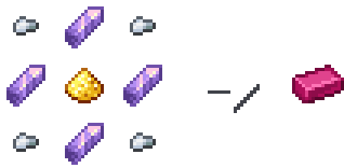
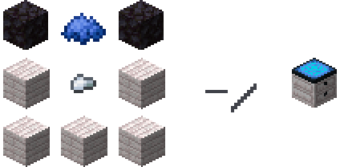

	

# About
**Swrontiope** is a *datapack* for *Minecraft Java Edition*; This datapack advances combat mechanics with new items, unique interactions, and useful guidance. Swrontiope comes with a powerful weapon, the **Powtensia Staff**; The Powtensia staff can be held in your *mainhand* and a usable item in your *offhand* can cause unique powers based on the held item!

# Items
## Guide Book
The *Guide Book* contains information of recipies and abilities included in this pack; This item is not needed if you're using this documentation. The guide book can be crafted inside a crafting table in this arrangement:

## Gold Dust
*Gold Dust* is a powdery substance of gold, mainly used to create purple gold ingots. Gold dust can be grinded in a *stone cutter*, having a ratio of 2 pieces of gold dust per gold ingot.

## Powtensia Staff
The *Powtensia Staff* helps with many mundane tasks, like walking or hiking up mountains. The staff can be used with many items for a wide variety of abilities and actions; The Powtensia Staff is a core part of this datapack, giving the player new powers based on the items they obtained. A ability can be activated by pressing or holding the right mouse button with the powtensia staff firmly gripped in your mainhand. To craft this, you will need 6 purple gold ingots, and a nether star put together in a workbench.

## Purple Gold Ingot
A shiny purple ingot of gold combined with 4 iron nuggets and amethyst shards; and a single gold dust combined all inside a workbench! This gold is used as a handle for the powtensia staff.

## Workbench
Craft many things with a workbench, including the powtensia staff! You are able to craft this by using 2 blocks of blackstone, a piece of blue dye, an iron nugget, and 5 blocks of any planks. All inside a crafting table!

# Structures
## Stadium
The *Stadium* is a structure that can only be found in *Savannas*, *Windswept Savannas*, and the *Badlands*. The stadium contains a single *Powtensia Staff* on a pedestal.

# Built-in Abilites
- **(Apple)**: Gives a golden apple to the player.
- **(Bone Meal)**: A projectile that heals a entity or summons a cow and a sheep on top of a block.
- **(Cod)**: A quick projectile that gives slight knockback and damage to a entity.
- **(Egg)**: A projectile that summons a chicken on a block, and a chicken jockey on a entity.
- **(Ender Pearl)**: A non-damaging way to teleport around!
- **(Healing Potion)**: Heals yourself.
- **(Lantern)**: Summons fire on blocks and poisons your enemies!
- **(Soul Lantern)**: A stronger, but slower lantern.
- **(All Music Discs)**: Plays the selected music!
- **(All Saplings)**: Grows the given sapling on the ground instantly!
- **(Slime Ball)**: Slows down the enemy directly, or as a puddle on the ground.
- **(Piston)**: Pistons you up into the air.
- **(Sticky Piston)**: Clips you through the floor when on the ground, but lifts you up when in the air (like a normal piston).

# Custom Abilities
Swrontiope supports custom *abilities* for the Powtensia staff. Abilities can be made very easily, including tools to create projectiles, shown by the datapack's built in abilities. An example of a custom ability can be found by the name *Throwable Presents*, this datapack can be used as a demonstration for you're custom abilities.

Abilities can easibly be added through *tags*. To create abilities, you're datapack needs to include the `swrontiope` namespace to the `data` directory in your datapack: `{datapack-name}/data/{namespace}/swrontiope/`. Add a *tags* folder to the new namespace with *function* inside. You can create a file called **abilities.json**.
To add projectiles, create a directory called *projectiles* having to files; **block.json** and **tick.json**.

# Notice
*Mojang is not affiliated with this project*
